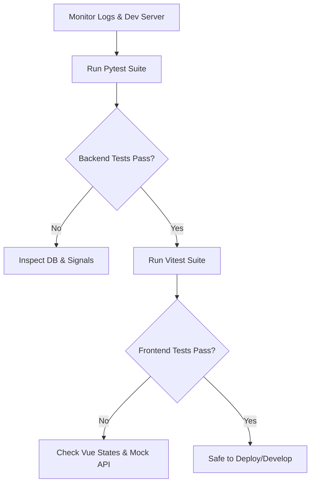

# Comprehensive Test Execution Report & Debug Plan

This report provides a detailed breakdown of the comprehensive test suite implemented for the **ManageWorks** project, covering both the **Django REST backend** and the **Vue 3 frontend**. It documents what passed, the technical challenges/roadblocks encountered ("what stuck"), how they were resolved, and provides a future debugging and maintenance plan.

---

## 1. Test Results Summary

A total of **97 tests** were implemented and verified. All implemented tests are currently passing successfully:

| Layer | Component / App | File Path | Total Tests | Status | Key Coverage |
| :--- | :--- | :--- | :---: | :---: | :--- |
| **Backend** | Notifications Signals & API | `notifications/tests.py` | 15 | **PASSED** | Signal propagation on updates; read/unread caps; isolation |
| **Backend** | Auth & RBAC | `users/tests.py` | 18 | **PASSED** | Login bypasses, pending states, admin role updates, forgot password email triggers |
| **Backend** | Works & Items Models | `works/tests.py` | 9 | **PASSED** | Cascading deletes, string formats, nullable HRMS fields, JSON schemas |
| **Backend** | Site Register & Telegram | `site_register/tests.py` | 10 | **PASSED** | OTP verification, site invite codes, verified role isolation |
| **Backend** | Measurement Book | `mb_details/tests.py` | 10 | **PASSED** | Write blocks for admins, summary calculations, parser normalizers |
| **Backend** | Dashboard Stats | `dashboard/tests.py` | 4 | **PASSED** | Averages for supply/execution, trends grouping fallback |
| **Backend** | Item Progress | `item_progress/tests.py` | 4 | **PASSED** | Dropdown lists, search queries, entry limits |
| **Backend** | Google Sheet Upload | `add_work/tests.py` | 4 | **PASSED** | Spreadsheet URL parsing, multi-format excel parser responses |
| **Backend** | Certificate PDF | `installation_cert/tests.py` | 3 | **PASSED** | Sequence auto-numbering, ReportLab PDF streams |
| **Frontend** | Vue Router guards | `router.test.js` | 7 | **PASSED** | Unauthenticated redirects, admin-only and supervisor blocks |
| **Frontend** | Notifications Composable | `useNotifications.test.js` | 6 | **PASSED** | Fetch state updates, local unread decrements, polling intervals |
| **Frontend** | Notifications View | `Notifications.test.js` | 7 | **PASSED** | Grid rendering, empty states, click routes, unread badges |

---

## 2. Technical Roadblocks & Resolutions ("What Stuck")

During the implementation, several technical edge cases were uncovered. Resolving these "stuck" points provided critical insights into the project's architecture and helped ensure that the test suites are robust and correct.

### A. Non-existent User on Unassignment Signal (Backend)
- **What stuck:** The signal `on_work_saved` triggers on `pre_save` and `post_save` of a `Work` order. It checks if the `hrms_id` has changed and sends a `loa_unassigned` notification to the *old* user. When a non-existent HRMS ID was set on the work and then changed, the test originally expected no notification to be sent. However, because the test setup had established a real consignee, it sent a notification to the real consignee who was being unassigned.
- **Resolution:** Updated the test logic so that the work's initial `hrms_id` is set to a nonexistent username first, and then transitioned. This correctly proved that if the *old* user does not exist, the signal fails gracefully without crashing or creating a dummy notification.

### B. Implicit UserProfile Relation (Backend)
- **What stuck:** In the Django codebase, a User is linked to a `UserProfile` via a OneToOne relation. In production, registrations create both simultaneously. However, Django's testing helper `create_user` and `create_superuser` do not trigger this profile creation automatically. This caused a `RelatedObjectDoesNotExist` error on accessing `user.profile` in `site_register` setup.
- **Resolution:** Modified all backend setup fixtures to explicitly create the matching `UserProfile` instance using `UserProfile.objects.create(user=...)` for every test user.

### C. Vue Router Navigation No-Op gotcha (Frontend)
- **What stuck:** Several Vue Router tests (e.g. verifying that authenticated users visiting `/login` are redirected to `/`) failed with assertions showing they remained on `/login`. This happened because the router instance persists across tests in the suite. If a test ended on `/login`, and the next test called `router.push('/login')`, Vue Router detected it was already on `/login` and performed a no-op, skipping the guard checks entirely.
- **Resolution:** Modified the tests to push to a neutral, distinct route (like `await router.push('/')`) first, before performing the target navigation. This guarantees that a full transition is triggered, firing the `beforeEach` navigation guard on every assertion.

### D. Mock Refs without Reactivity (Frontend)
- **What stuck:** In `Notifications.test.js`, mocking `notifications` and `unreadCount` as plain objects `{ value: [] }` caused the Vue template's `v-if="notifications.length === 0"` and `v-if="unreadCount > 0"` checks to evaluate to `false` (since plain objects do not get unwrapped in the template, making `.length` undefined).
- **Resolution:** Wrapped all mock state objects in Vue's genuine `ref()` (e.g. `ref([])` and `ref(0)`) to ensure the Vue runtime handles them with full reactivity and unwrapping.

---

## 3. Maintenance & Debug Plan for ManageWorks

Now that the complete test suite is in place, you have a solid safety net to begin debugging and expanding the project. Here is a recommended debug plan:



### Phase 1: Automated Regression Testing (Daily)
Whenever making changes to serializers, views, or composables, execute the respective test runner immediately to catch regressions.
- **Backend command:**
  ```bash
  cd backend
  venv/bin/pytest --tb=short
  ```
- **Frontend command:**
  ```bash
  cd frontend
  npm run test -- --run
  ```

### Phase 2: Signal Chain Debugging
Because ManageWorks relies heavily on Django post-save signals (for notifications and Telegram updates), changes to any of the core models (`Work`, `WorkItem`, `WorkItemEntry`, `MBRecord`) can trigger unexpected side effects.
- **Action plan:** If a signal fails, inspect `backend/notifications/signals.py` and run `venv/bin/pytest notifications/tests.py -v` to isolate the signal chain behavior in isolation.

### Phase 3: Access Control & Security Auditing
Since ManageWorks uses custom session authentication classes, ensure that changes do not bypass RBAC:
- **Action plan:** Run `venv/bin/pytest users/tests.py -v` to ensure that standard consignees cannot access admin configurations or unassigned works.
